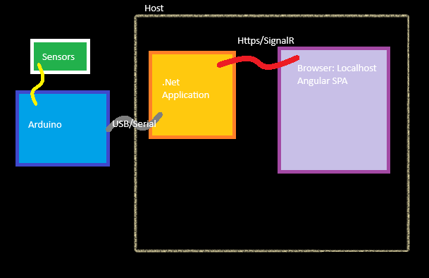

# Skunk

Air Quality Sensor Package

- The red circle is the max value that has been seen
- The grey circle is the rolling average value

## Setup

- The hardware (an Arduino with attached sensors at this point) communicates via serial connection
  - source/skunk.arduino
  - Outputs sensor data via serial
- .Net application 
  - source/SkunkBackend
  - Hosts the UI as a website
  - Hosts a SignalR Hub to push data to clients
  - Connects to the hardware via serial connection
- Angular SPA
  - source/skunkapp
  - Subscribes via SignalR to data updates

## Development

To develop the project on raspberry pi, run
> curl -sSL <https://dot.net/v1/dotnet-install.sh> | bash /dev/stdin --channel LTS

then

> echo 'export DOTNET_ROOT=$HOME/.dotnet' >> ~/.bashrc
echo 'export PATH=$PATH:$HOME/.dotnet' >> ~/.bashrc
source ~/.bashrc
