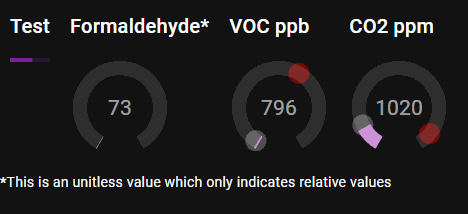

# Skunk

Air Quality Sensor Package

- The red circle is the max value that has been seen
- The grey circle is the rolling average value

## Development

To build the project on raspberri pi, run
> curl -sSL <https://dot.net/v1/dotnet-install.sh> | bash /dev/stdin --channel LTS

then
>  echo 'export DOTNET_ROOT=$HOME/.dotnet' >> ~/.bashrc
echo 'export PATH=$PATH:$HOME/.dotnet' >> ~/.bashrc
source ~/.bashrc